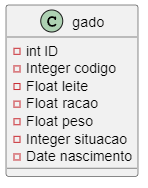

# Teste-FullStack_DFranquias

    Software web PHP em symfony responsável por gerenciar o gados em uma fazenda.

Esta aplicação tem como objetivo cumprir o -> [teste](https://drive.google.com/file/d/1yP_Ld1zXsgh8FXGRk8lODTsN48BusBHh/view?usp=sharing) <- para a vaga na DFranquias.

## Stack
* Implementação feita em PHP >=8.0.*;
* Utiliza o framework Symfony >=6.0*;
* Banco de dados MySQL >=8.0*;
* Maiores detalhes podem ser encontrados no arquivo composer.json na raiz do projeto.

 Links das dependências:

   [Paginator](https://github.com/KnpLabs/KnpPaginatorBundle)

    Form
        \
         composer require symfony/form

    Doctrine ORM
        \
         composer require symfony/orm-pack

    Bootstrap
        \
         composer require twbs/bootstrap:5.3.2

## Execução do projeto

    O projeto está configurado para rodar com o Docker, clone este repositorio e execute a próxima linha com o Docker instalado em sua máquina.

        docker compose up --build

    Para acessar : localhost:8000

## Execução do projeto sem o docker

#### db preenchido
Após verificar as dependências, caso queira executar o projeto com um banco já preenchido, siga próximo passo:
Importe o arquivo anexado no repositório em seu banco de dados, depois execute os comandos do item 1, o sistema estará em funcionamento com o banco pronto.

#### db vazio
1- Na pasta raiz do projeto, execute: 
* verificar todas as dependências do projeto

    composer require symfony/runtime 

* startar fw

    symfony serve:start              

2- Após, crie o banco de dados com o seguinte comando: 

    php bin/console doctrine:database:create

3- Logo em seguida, ultilize este para executar a migration:

    php bin/console doctrine:migrations:migrate

Confirme todos os parametros e o projeto estará em funcionamento na localhost.

# Entidade

Animais podem ser adicionados, editados e excluídos. Todo animal vivo deve ter um código; animais abatidos e mortos não precisam.

### Banco de dados

De acordo com o tipo de execução, descomentar a linha desejada no .env para configuração do db local ou docker.
